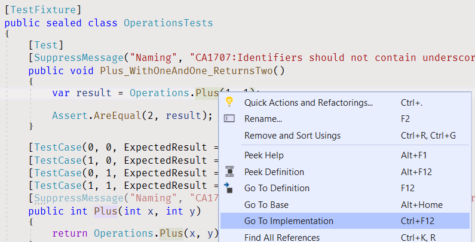
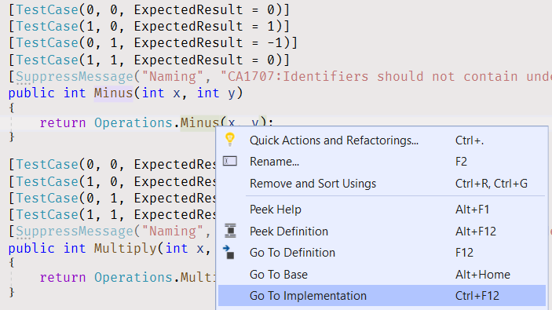
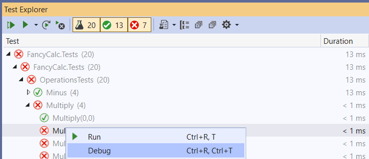
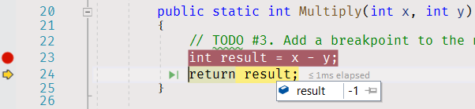

# Fancy Calculator

Задача начального уровня для практики навыка управления задачами в AutoCode. Переводы: [Английский](README.md).


## Заберите проект

* [Откройте проект в Visual Studio из внешнего Git-репозитория](https://docs.microsoft.com/ru-ru/visualstudio/get-started/tutorial-open-project-from-repo) или [склонируйте внешний Git-репозиторий на Ваш локальный диск](https://docs.microsoft.com/ru-ru/azure/devops/repos/git/clone#clone-from-another-git-provider) при помощи Visual Studio.


## Завершите задачу

1. [Соберите проект](https://docs.microsoft.com/en-us/visualstudio/ide/building-and-cleaning-projects-and-solutions-in-visual-studio).
    * Выберите элемент меню - _Build\Build Solution_.
    * Или используйте сочетание клавиш - _Ctrl+Shift+B_.


2. Откройте [Test Explorer](https://docs.microsoft.com/ru-ru/visualstudio/test/run-unit-tests-with-test-explorer).
    * Выберите элемент меню - _View\Test Explorer_.
    * Или используйте сочетание клавиш - _Ctrl+E, T_.


3. Запустите все юнит-тесты. Проект содержит 20 юнит тестов, как минимум 15 юнит тестов в Test Explorer должны быть "красными".
    * Выберите элемент меню - _Test\Run All Tests_.
    * Или используйте сочетание клавиш - _Ctrl+R, A_.


4. Двойной клик на юнит-тесте "Plus_WithOneAndOne_ReturnsTwo". Visual Studio откроет окно редактора кода для [OperationsTests.cs](FancyCalc.Tests/OperationsTests.cs) файла и перенаправит вас к коду юнит-теста.


5. Перейдите к коду "Operations.Plus" метода.
    * Нажмите правой кнопкой мыши на имя метода "Plus" на 13 строке и нажмите на элементе меню "Go to Definition".
    * Или кликните на имени метода "Plus" на 13 строке и используйте сочетание клавиш _F12_.
    * Или кликните на имени метода "Plus" на 13 строке, зажав клавишу _Ctrl_.



6. Visual Studio откроет окно редактора кода для [Operations.cs](FancyCalc/Operations.cs) файла и перенаправит вас к коду метода.
1. Перейдите на строку 10.
    * Используйте клавиши курсора.
    * Или используйте сочетание клавиш - _Ctrl+G_, нажмите 10 и клавишу _Enter_.


8. Раскомментируйте текущую строку.
    * Используйте сочетание клавиш - _Ctrl+K, Ctrl+U_.

```cs
public static int Plus(int x, int y)
{
    // TODO #1. Uncomment the line below and remove the line that throws NotImplementedException.
    return x + y;
    throw new NotImplementedException();
}
```

9. Перейдите на следующую строку - строка 11.
10. Закомментируйте текущую строку.
    * Используйте сочетание клавиш - _Ctrl+K, Ctrl+C_.

```cs
public static int Plus(int x, int y)
{
    // TODO #1. Uncomment the line below and remove the line that throws NotImplementedException.
    return x + y;
    //throw new NotImplementedException();
}
```

11. Откройте вкладку Test Explorer, запустите все юнит-тесты. Все "Plus" юнит-тесты и "Plus_WithOneAndOne_ReturnsTwo" юнит-тесты сейчас "зеленые".


12. Просмотрите "Minus" юнит-тесты в списке тестов. Только один юнит-тест "зеленый", другие - "красные".


13. Перейдите к коду юнит-теста, а затем перейдите к коду метода "Minus" в файле [Operations.cs](FancyCalc/Operations.cs).



14. Исправьте код метода "Minus" в соответствии с TODO комментариями.

```cs
public static int Minus(int x, int y)
{
    // TODO #2. Replace "x + y - x" in the next line with "x - y".
    return x + y;
}
```

15. Откройте вкладку Test Explorer, кликните на строке "Minus (4)" и запустите все юнит-тесты "Minus", используя пункт меню при клике правой кнопки мыши. Юнит тесты "Minus" должны быть зелеными.


16. Перейдите к юнит-тесту "Multiply", а затем к коду метода "Multiply" в файле [Operations.cs](FancyCalc/Operations.cs).


17. Добавьте точку останова на строке 23.
    * Кликните на вертикальной полосе слева от строки 23.
    * Или используйте клавишу - _F9_.


18. Откройте вкладку Test Explorer и запустите "зеленый" юнит-тест "Multiply(0, 0)" в режиме отладки.
    * Кликните правой кнопкой мыши на юнит-тесте "Minus" и выберите элемент меню "Debug".
    * Или используйте сочетание клавиш - _Ctrl+R, T_.



19. Отследите выполнение программы.
    * Кликните на элементе меню "Debug\Step Over".
    * Или используйте клавишу - _F10_.
    * Или используйте соответствующий пункт меню вкладки "Debug" на панели меню.


20. Изучите переменную "result".
    * Наведите курсор мыши на переменную "result" на строке 24.



21. Остановите отладку.
    * Кликните на элементе меню "Debug\Stop Debugging".
    * Или используйте клавишу - _Shift+F5_.


1. Удалите точку останова на строке 23 и добавьте точку останова на строке 24.
1. Выполните "красный" юнит-тест "Multiply(0, 1)" снова в режиме отладки.
1. Изучите переменную "result".
1. Продолжите выполнение программы.
    * Кликните на пункте меню "Debug\Continue".
    * Или используйте клавишу - _F5_.
    * Или используйте соответствующий пункт меню вкладки "Debug" на панели меню.
1. Исправьте код метода "Multiply" в соответствии с TODO комментарием.
1. Откройте вкладку Test Explorer и запустите снова все юнит-тесты "Multiply". Сейчас юнит-тесты "Multiply" должны быть "зелеными".
1. Откройте вкладку Test Explorer и запустите все юнит-тесты "Sum". Некоторые юнит-тесты должны быть "красными".
1. Добавьте точку останова на строке 30.
1. Запустите один из проваленных юнит-тестов в режиме отладки.
1. Проследите выполнение программы, чтобы обнаружить проблему.
1. Исправьте код.
1. Откройте вкладку Test Explorer и запустите все юнит-тесты "Sum". Сейчас юнит-тесты "Sum" должны быть "зелеными".
1. Запустите все юнит-тесты и удостоверьтесь, что все они "зеленые".


## Исправьте проблемы компилятора

Для проектов в этом решении включены дополнительные проверки стиля и кода. Они помогут Вам поддерживать согласованность исходного кода проекта и избегать глупых ошибок. [Просмотрите список ошибок](https://docs.microsoft.com/ru-ru/visualstudio/ide/find-and-fix-code-errors#review-the-error-list) в Visual Studio, чтобы увидеть все предупреждения и ошибки компилятора.

Если текст ошибки или предупреждения компилятора Вам не ясен, [просмотрите подробные сведения об ошибке](https://docs.microsoft.com/ru-ru/visualstudio/ide/find-and-fix-code-errors#review-errors-in-detail) или введите в поиске google код ошибки или предупреждения, чтобы получить больше информации о проблеме.

Также, вы можете использовать [Базу знаний правил Sonar](https://rules.sonarsource.com/csharp) для поиска более детальной информации касательно обнаруженных предупреждений Sonar.


## Сохраните вашу работу

* [Пересоберите решение](https://docs.microsoft.com/ru-ru/visualstudio/ide/building-and-cleaning-projects-and-solutions-in-visual-studio) в Visual Studio.
* Проверьте [окно Error List](https://docs.microsoft.com/ru-ru/visualstudio/ide/reference/error-list-window) на ошибки и предупреждения компилятора. Если у вас имеются какие-либо ошибки и предупреждения, **исправьте проблемы** и перекомпилируйте решение снова.
* [Запустите все юнит-тесты в Test Explorer](https://docs.microsoft.com/ru-ru/visualstudio/test/run-unit-tests-with-test-explorer) и удостоверьтесь, что **нет проваленных юнит-тестов**. Исправьте ваш код, [чтобы сделать все юнит-тесты ЗЕЛЕНЫМИ](https://stackoverflow.com/questions/276813/what-is-red-green-testing).
* Просмотрите все изменения **до** сохранения вашей работы.
    * Откройте вкладку "Changes" в [Team Explorer](https://docs.microsoft.com/ru-ru/visualstudio/ide/reference/team-explorer-reference).
    * Нажмите правой кнопкой мыши на измененном файле.
    * Нажмите пункт меню "Compare with Unmodified", чтобы открыть окно сравнения.
* [Подготовьте изменения](https://docs.microsoft.com/ru-ru/azure/devops/repos/git/commits#stage-your-changes) и [создайте коммит](https://docs.microsoft.com/ru-ru/azure/devops/repos/git/commits#create-a-commit).
* Поделитесь вашими изменениями, [отправив их на удаленный репозиторий](https://docs.microsoft.com/ru-ru/azure/devops/repos/git/pushing).


## Дополнительная информация

* Visual Studio
  * [Знакомство с отладчиком Visual](https://docs.microsoft.com/ru-ru/visualstudio/debugger/debugger-feature-tour)
  * [Краткое руководство: Отладка кода C# или Visual Basic с помощью отладчика Visual Studio](https://docs.microsoft.com/ru-ru/visualstudio/debugger/quickstart-debug-with-managed)
  * [Учебник. Сведения об отладке кода C# с помощью Visual Studio](https://docs.microsoft.com/ru-ru/visualstudio/get-started/csharp/tutorial-debugger)
  * [Переходите по коду с помощью отладчика Visual Studio](https://docs.microsoft.com/ru-ru/visualstudio/debugger/navigating-through-code-with-the-debugger)
  * [Сочетания клавиш по умолчанию в Visual Studio](https://docs.microsoft.com/ru-ru/visualstudio/ide/default-keyboard-shortcuts-in-visual-studio)